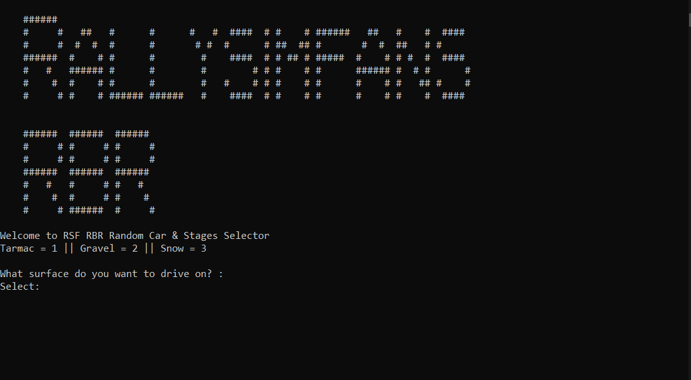

# Rallysimfans Richard Burns Rally: Cars and Stages Randomizer

My small program when learning C++

Car and Stages randomizer will give you option what surface you want to drive on (Tarmac, Gravel, Snow) 
When picked between those 3, the program will give you random stage and car to drive

The base idea from [CRSimRacing](https://www.youtube.com/watch?v=Jd_v_1_8iM0 "Richard Burns Car&Stage Picker Python Script")'s car and stages picker python script but using C++ instead.

Feel free to use and modify it as your learning project

TODO: 
- adding choices between car classes
- adding randomizer for stages condition (dry/damp/wet)

# Preview

